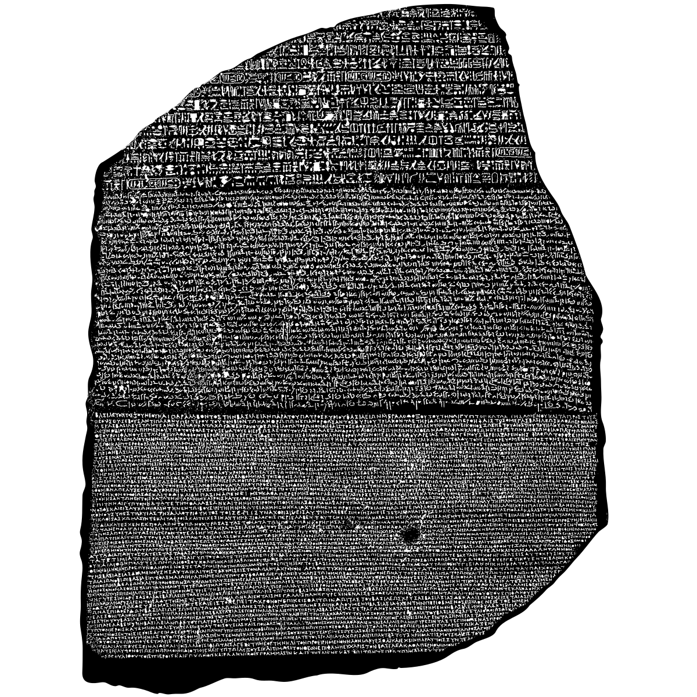

# PuzzlePal

... who is better at locating jigsaw puzzle pieces than I can.

[This puzzle](https://www.britishmuseumshoponline.org/rosetta-stone-jigsaw-puzzle.html) incentizes this script. Only picture patterns are used, so this script can't help with those without a picture such as [the white hell](https://www.amazon.ca/gp/product/B008DCQE3O/)

## Requirements

* Python3
* OpenCV
* matplotlib
* numpy

## References

* <https://medium.com/cornell-tech/jigsolved-computer-vision-to-solve-jigsaw-puzzles-70b8ad8099e5>
* <https://docs.opencv.org/4.x/dc/dc3/tutorial_py_matcher.html>
* Rosetta Stone image credit <https://en.wikipedia.org/wiki/File:Rosetta_Stone.svg>
